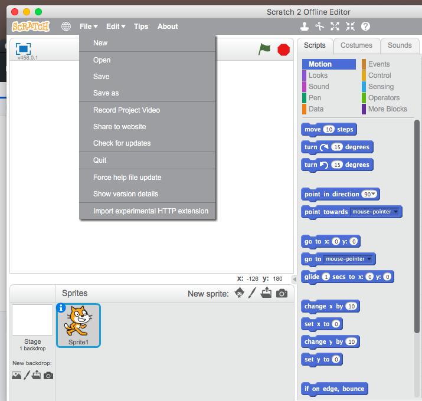
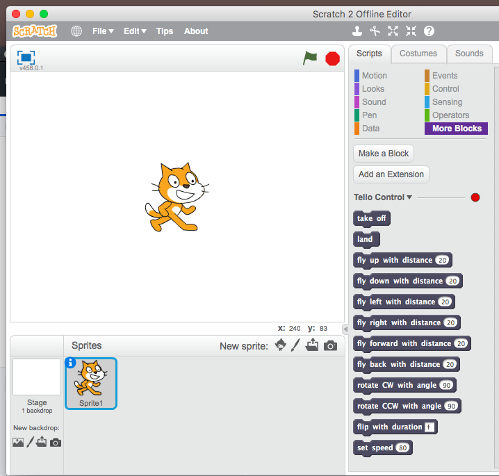
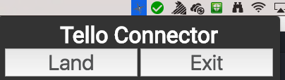

# TelloConnector
An Easy To Use Connector Between The Tello Drone And The Scratch Programming Language

# Download
[Downloads](https://github.com/oscartbeaumont/TelloConnector/releases)

# How It Works
## Install The Scratch Block
Open Scratch On Your Computer, Hold Down Shift And Click "File" Which Is In The Top Menu. Click The Bottom Option Which Is Called "Import experimental HTTP extension" and It Will Open A File Browser. Select The File Called "Tello.s2e" In The Base of This Repository. This Will Then Add The Custom Tello Blocks To The Scratch Programming Enviroment. You Can Then Select "More Blocks" In The Scratch Block Section Selector And It Will Give You All Of The Blocks For Controlling The Tello.


#### *The Scratch Menu When Holding Scratch*


#### *The Tello Blocks In The Scratch Enviroment*

The Red Light In That Menu Will Tell You If Scratch Can Communcate With The TelloConnector Application and Does Not Represent If It Is Connected To The Drone.

## Using The Tello Connector
First Start The Application By Running The .app File. Then Connect Your Computer To The WIFI Network Of The Tello. Then You Can Start Sending Commands From Scratch By Running Programs That Use The Tello Blocks. If You Click The Menu Item It Will Give You A menu Which Allows You To Land The Drone and Exit The TelloConnector Application.


#### *The Menu Bar Icon And The Menu*

# How To Install
The code below is how to run it. It is built using Electron which requires Nodejs (and Yarn) To Work With.
```bash
git clone https://github.com/oscartbeaumont/TelloConnector.git
yarn
yarn start # Run It In Development Mode
yarn build-mac # Compiles The Code To A .app File
```
